# SMASH 3 — Architecture Document

## Overview

A modular 2D platform fighting game for **1–4 players** (any mix of human + AI) built with **vanilla JavaScript + Canvas 2D**. Features a damage-percentage knockback system, directional attacks & specials, an ultimate meter, projectile entity framework, AI difficulty 1–9, and controller abstraction for keyboard/gamepad.

Served via any static HTTP server — no build step required.

---

## File Structure

```
smash 3/
├── index.html                  ← entry point, menu overlay, script tags
├── styles.css                  ← menu + canvas styling
├── ARCHITECTURE.md             ← this document
│
├── js/                         ← all game code (dependency order in index.html)
│   ├── settings.js             ← global constants & tuning knobs
│   ├── Hitbox.js               ← Hitbox, Hurtbox, Collision utilities
│   ├── FighterData.js          ← character roster + FighterData class
│   ├── Projectile.js           ← base Projectile, 9 subtypes, ProjectileManager
│   ├── Fighter.js              ← Fighter state machine, attacks, rendering
│   ├── Physics.js              ← gravity, friction, platforms, blast zones
│   ├── Camera.js               ← dynamic zoom camera tracking fighters
│   ├── Stage.js                ← Platform + Stage classes (moving platforms)
│   ├── StageLibrary.js         ← 6 pre-built stages (3 classic + 3 large)
│   ├── Controller.js           ← InputState data class
│   ├── InputManager.js         ← unified input abstraction + DeviceManager
│   ├── KeyboardController.js   ← WASD / Arrows / IJKL keyboard layouts
│   ├── GamepadController.js    ← raw Gamepad API polling
│   ├── AIController.js         ← behavior-tree AI, difficulty 1–9
│   ├── HUD.js                  ← damage %, stocks, meter, shield bar
│   ├── UltimateManager.js      ← cinematic ultimate cutscene system
│   ├── CharacterSelectScene.js ← interactive 4-slot character select
│   ├── Game.js                 ← core match loop + lifecycle
│   └── main.js                 ← scene orchestrator / entry point
│
├── assets/
│   ├── sounds/
│   ├── stages/
│   └── ui/
│
├── characters/                 ← (Python-side roster, not used by JS)
├── engine/                     ← (Python-side engine, not used by JS)
├── entities/                   ← (Python-side entities, not used by JS)
├── input/                      ← (Python-side input, not used by JS)
└── stages/                     ← (Python-side stages, not used by JS)
```

**Script load order** (defined in `index.html`):
1. Core: `settings.js`, `Hitbox.js`
2. Data: `FighterData.js`
3. Entities: `Projectile.js`, `Fighter.js`
4. World: `Physics.js`, `Camera.js`, `Stage.js`, `StageLibrary.js`
5. Input: `Controller.js`, `InputManager.js`, `KeyboardController.js`, `GamepadController.js`, `AIController.js`
6. UI / Systems: `HUD.js`, `UltimateManager.js`, `CharacterSelectScene.js`
7. Game + Entry: `Game.js`, `main.js`

All modules attach to a global `SMASH` namespace via IIFEs.

---

## Class Diagram

```mermaid
classDiagram
    direction TB

    class Game {
        +HTMLCanvasElement canvas
        +Physics physics
        +Camera camera
        +HUD hud
        +ProjectileManager projMgr
        +UltimateManager ultMgr
        +Stage stage
        +Player[] players
        +Fighter[] fighters
        +string state
        +start()
        +stop()
        -_loop(now)
        -_update(dt)
        -_render()
        -_tickPlaying(dt)
        -_resolveCombat()
        -_checkGameOver()
    }

    class Player {
        +int port
        +Fighter fighter
        +Controller controller
        +bool isAI
    }

    class Fighter {
        +int port
        +FighterData data
        +float x, y, vx, vy
        +float damagePercent
        +float ultimateMeter
        +int stocks
        +string state
        +int facing
        +Hitbox activeHitbox
        +Hurtbox hurtbox
        +int hitstunFrames
        +int _consecutiveHits
        +update(inp, dt) event
        +takeHit(hitbox, facing, isSpecial)
        +die()
        +render(ctx, cam)
        +static calcKB(dmg, pct, wt, base, scale)
    }

    class FighterData {
        +string name
        +float weight, width, height
        +float walkSpeed, runSpeed, airSpeed
        +float jumpForce, doubleJumpForce
        +int maxJumps
        +Dict~string,AttackData~ attacks
        +AttackData ultimateAttack
    }

    class AttackData {
        +string name
        +string sprite
        +string hitboxShape
        +float damage, baseKB, kbScaling, angle
        +int startupFrames, activeFrames, endlagFrames
        +bool spawnsProjectile
        +string projectileType
    }

    class Hitbox {
        +string shape
        +int ownerPort
        +float offsetX, offsetY
        +float width, height, radius
        +float damage, baseKB, kbScaling, angle
        +int activeFrames, framesRemaining
        +Set alreadyHit
        +checkHit(attacker, target) bool
        +checkHitAt(wx, wy, pw, ph, facing, target) bool
        +static fromAttack(port, atk) Hitbox
    }

    class Hurtbox {
        +Fighter fighter
        +getRect() Rect
    }

    class Projectile {
        +int ownerPort
        +string type
        +float x, y, vx, vy, w, h
        +int lifetime
        +Hitbox hitbox
        +bool piercing
        +update(dt)
        +collideStage(stage)
        +checkHits(fighters)
        +render(ctx, cam)
    }

    class ProjectileManager {
        +Projectile[] list
        +spawn(proj)
        +spawnFromAttack(fighter, atk)
        +update(dt, fighters, stage)
        +render(ctx, cam)
        +clear()
    }

    Projectile <|-- LinearProjectile
    Projectile <|-- ArcProjectile
    Projectile <|-- BoomerangProjectile
    Projectile <|-- PiercingProjectile
    Projectile <|-- StationaryProjectile
    Projectile <|-- LaserBeam
    Projectile <|-- BlastProjectile
    Projectile <|-- BarrelProjectile
    Projectile <|-- EnergyWave
    StationaryProjectile <|-- ExplosionEffect

    class InputState {
        +float moveX
        +float moveY
        +bool jump
        +bool attack
        +bool special
        +bool shield
        +bool grab
    }

    class InputManager {
        +string deviceType
        +poll() InputState
        +remapButton(action, btn)
        +static clearFrame()
    }

    class DeviceManager {
        +scan()
        +getDevices()
        +assignDevice(port, id)
    }

    class KeyboardController {
        +poll() InputState
        +static clearFrame()
    }

    class GamepadController {
        +poll() InputState
    }

    class AIController {
        +int port
        +int difficulty
        +Object profile
        +setContext(fighters, stage, projs)
        +poll() InputState
    }

    class Physics {
        +update(fighter, stage, dt)
    }

    class Camera {
        +float x, y, zoom
        +update(fighters, stage, dt)
        +wtsx(wx) float
        +wtsy(wy) float
    }

    class Stage {
        +string name
        +Platform[] platforms
        +Rect blastZone
        +Array spawns
        +update(dt)
        +render(ctx, cam)
    }

    class Platform {
        +Rect rect
        +bool passthrough
        +bool isMoving
        +Object motion
        +update(dt)
        +render(ctx, cam)
    }

    class HUD {
        +render(ctx, players, matchTime)
    }

    class UltimateManager {
        +bool active
        +string phase
        +trigger(attacker, allFighters)
        +update(dt)
        +render(ctx)
    }

    class CharacterSelectScene {
        +PlayerSlot[] slots
        +start()
        +stop()
        +onStartMatch callback
    }

    class PlayerSlot {
        +int port
        +bool active
        +string characterKey
        +string controllerType
        +int aiDifficulty
        +bool ready
        +getConfig() Object
    }

    Game *-- Player
    Game *-- Physics
    Game *-- Camera
    Game *-- HUD
    Game *-- ProjectileManager
    Game *-- UltimateManager
    Game *-- Stage
    Player *-- Fighter
    Player *-- InputManager
    Fighter *-- FighterData
    Fighter *-- Hurtbox
    Stage *-- Platform
    CharacterSelectScene *-- PlayerSlot
```



---

## Core Game Loop

```
main.js
  │
  ▼
showMenu()  →  startBtn click  →  showCharSelect(settings)
                                    │
                                    ▼
                              CharacterSelectScene
                                (4 slots: char + human/AI + difficulty)
                                    │  all ready + ENTER
                                    ▼
                              startGame(configs, settings)
                                    │
                                    ▼
                              new Game(canvas, playerConfigs, settings)
                                    │
                                    ▼
                              game.start()  →  requestAnimationFrame loop
```

### Per-frame update (`Game._loop → Game._update`):

```
_update(dt)
 │
 ├─ state = 'countdown'?  →  _tickCountdown(dt)
 │      decrement timer, animate 3-2-1-GO, camera tracks fighters
 │
 ├─ state = 'playing'?    →  _tickPlaying(dt)
 │      │
 │      ├─ 0. Ultimate cutscene active?  →  ultMgr.update(dt), return
 │      ├─ 1. Poll input for each player → fighter.update(inp, dt)
 │      │       Returns events ({ type: 'ultimate', port })
 │      ├─ 2. _resolveCombat()
 │      │       For each fighter with active hitbox:
 │      │         checkHit vs all other fighters
 │      │         takeHit(hitbox, facing, isSpecialHit)
 │      │           → shield absorption OR
 │      │           → focus armor absorption OR
 │      │           → normal hit: damage, knockback, hitstun
 │      │           → 250% + special? → INSTANT KO knockback
 │      ├─ 3. Snapshot damage for projectile stat tracking
 │      ├─ 4. projMgr.update(dt, fighters, stage)
 │      │       Move projectiles, stage collision, fighter hits,
 │      │       proj-vs-proj cancel by priority, prune dead, spawn explosions
 │      ├─ 5. stage.update(dt)  →  tick moving platforms
 │      ├─ 6. physics.update(fighter, stage, dt)  for each alive fighter
 │      │       Gravity, friction, platform collision, blast zone → die()
 │      ├─ 7. Detect deaths, credit kills via _lastHitBy, KO notification
 │      ├─ 8. camera.update(fighters, stage, dt)
 │      └─ 9. _checkGameOver()  →  last player standing → 'gameover'
 │
 ├─ state = 'paused'?     →  _tickPause()
 │      Overlay menu: Resume / Restart / Quit
 │
 └─ state = 'gameover'?   →  _tickGameOver()
         Results + stats overlay: Rematch / Char Select / Main Menu
```

### Render pipeline (`Game._render`):

```
1. Clear canvas with stage.bgColor
2. stage.render(ctx, cam)        — background layers + platforms
3. projMgr.render(ctx, cam)      — all active projectiles
4. fighters[].render(ctx, cam)   — colored boxes + direction eye + labels
5. hud.render(ctx, players)      — damage %, stocks, ult meter, shield
6. ultMgr.render(ctx)            — ultimate cutscene overlay
7. KO notification flash
8. State overlays (countdown / pause / gameover)
```

---

## Entity System

All game entities exist as plain objects/classes — no ECS framework. The three entity categories:

### 1. Fighters (`Fighter.js`)
- Owned by a `Player` object (port + controller)
- Have position, velocity, state, combat stats
- Updated per-frame via `fighter.update(inputState, dt)` → returns optional events
- Rendered as colored rectangles (no sprites required — static PNG paths defined but optional)
- Hitbox created dynamically per-attack via `Hitbox.fromAttack()`

### 2. Projectiles (`Projectile.js`)
- Independent entities managed by `ProjectileManager`
- Spawned from `Fighter` attacks that have `spawnsProjectile: true`
- Each has its own `Hitbox`, velocity, lifetime, stage collision mode
- **9 subtypes**: Linear, Arc, Boomerang, Piercing, Stationary, LaserBeam, BlastProjectile, BarrelProjectile, EnergyWave
- **1 effect**: ExplosionEffect (spawned on BlastProjectile death)
- Factory: `ProjectileManager.spawnFromAttack(fighter, attackData)`
- Proj-vs-proj cancellation by priority level

### 3. Platforms (`Stage.js`)
- Solid or passthrough
- Optional moving platform configs (linear / loop / pendulum waypoints)
- Carry riders via velocity transfer

### Entity Lifecycle:
```
Fighter:  spawn → alive (update loop) → die() → respawn / DEAD state
Projectile: spawn → alive → update/collide → kill() → pruned from list
                                                  └→ onDeathSpawn → ExplosionEffect
Platform: static or ticked by Stage.update(dt)
```

---

## State Machine Logic

### Fighter States (`Fighter.States`):

```
                    ┌─────────────────────────────────────┐
                    │            ACTIONABLE               │
                    │   ┌──────┐  ┌──────┐  ┌─────────┐  │
                    │   │ IDLE │─►│ WALK │─►│   RUN   │  │
                    │   └──┬───┘  └──────┘  └─────────┘  │
                    │      │                              │
                    │      ▼                              │
                    │   ┌──────────┐   ┌──────────────┐  │
                    │   │ AIRBORNE │   │   SHIELD     │  │
                    │   └────┬─────┘   └──────┬───────┘  │
                    └────────┼────────────────┼──────────┘
                             │                │
         ┌───────────────────┼────────────────┤
         │                   │                ▼
         ▼                   ▼         ┌──────────────┐
  ┌────────────┐     ┌────────────┐    │ SHIELD_STUN  │
  │  JUMPSQUAT │     │   ATTACK   │    │  (break)     │
  │  (3 frames)│     │  startup → │    └──────────────┘
  └────────────┘     │  active →  │
                     │  endlag    │
                     ├────────────┤
                     │  SPECIAL   │
                     ├────────────┤
                     │  ULTIMATE  │
                     └─────┬──────┘
                           │ hit!
                           ▼
                     ┌──────────┐
                     │ HITSTUN  │──► IDLE / AIRBORNE
                     └──────────┘
                           │ up-B spent
                           ▼
                     ┌──────────┐
                     │ HELPLESS │──► lands → IDLE
                     └──────────┘

                     ┌──────────┐
                     │  FOCUS   │ = startup with super-armor
                     │ (down-B) │──► ATTACK (active phase)
                     └──────────┘

                     ┌──────────┐
                     │   DEAD   │ = stocks exhausted
                     └──────────┘
```

**LOCKED states** (cannot act): `ATTACK, SPECIAL, HITSTUN, HELPLESS, ULTIMATE, JUMPSQUAT, SHIELD_STUN, FOCUS`

**Actionable states**: `IDLE, WALK, RUN, AIRBORNE, SHIELD` — can start attacks, jump, move.

### Attack Phases:
```
startup (N frames)  →  active (hitbox spawned, N frames)  →  endlag (N frames)  →  end
```

### Game States:
```
countdown  →  playing  ⇄  paused
                       →  gameover  →  Rematch (restart) / Char Select / Menu
```

---

## Damage & Percent Management System

### Core Concept
Fighters accumulate **damage percentage** (0%–∞). Higher % = more knockback = easier to KO by launching off blast zones.

### Damage Application (`Fighter.takeHit`)

```
1. Shield check:
   └─ shielding? → absorb damage to shieldHP, apply pushback → DONE
   └─ shieldHP ≤ 0 → SHIELD_STUN (shield break, 150 frames)

2. Focus armor check:
   └─ armored? → take damage but NO knockback/hitstun → DONE
   └─ decrement _armorHitsLeft

3. Normal hit:
   a. damagePercent += hitbox.damage
   b. Charge ultimate meter:  meter += damage × DMG_TO_METER (0.6)
      capped at ULT_CHARGE_CAP (200%)
   c. Knockback calculation (see formula)
   d. Apply velocity: vx/vy from KB magnitude + launch angle
   e. Hitstun frames (with reduced stun system)
   f. State → HITSTUN

4. ★ INSTANT KO CHECK:
   └─ If isSpecialHit AND damagePercent ≥ 250%
      → KB = INSTANT_KO_KB (2000) — guaranteed blast zone exit
```

### Knockback Formula

```javascript
static calcKB(damage, percent, weight, baseKB, kbScaling) {
    const raw = damage × KB_DMG_FACTOR + damage × (percent / KB_PCT_DIVISOR);
    const wf  = weight × 0.1 + 1.0;
    return (raw / wf) × kbScaling + baseKB;
}
```

- `KB_DMG_FACTOR = 0.12` — flat damage-to-KB contribution
- `KB_PCT_DIVISOR = 150` — higher % = more KB (percent scaling)
- `weight` — heavier characters resist knockback (wf divides raw KB)
- `baseKB` — minimum knockback per move
- `kbScaling` — per-move multiplier on the scaling portion

### Reduced Stun Duration System

Prevents infinite combos & feels less oppressive:

```
rawStun = floor(KB × KB_HITSTUN_FACTOR)            // base hitstun
decayMult = HITSTUN_DECAY ^ (consecutiveHits - 1)  // 0.85 per successive hit
finalStun = min(HITSTUN_MAX_FRAMES, floor(rawStun × decayMult))
```

| Consecutive Hit | Decay Multiplier | Effect                                 |
|-----------------|------------------|-----------------------------------------|
| 1st             | 1.00             | Full hitstun                           |
| 2nd             | 0.85             | 15% less hitstun                       |
| 3rd             | 0.72             | 28% less hitstun                       |
| 4th             | 0.61             | 39% less hitstun                       |
| 5th+            | ≤0.52            | Hitstun halved — escape combos easily  |

- **Hard cap**: `HITSTUN_MAX_FRAMES = 90` (1.5 seconds at 60fps)
- **Combo reset**: After 60 frames without being hit, `_consecutiveHits` resets to 0

### Ultimate Meter

```
Charge rate:   meter += damageTaken × DMG_TO_METER (0.6)
Charge cap:    stops charging when damagePercent ≥ 200%
Max meter:     ULT_MAX = 100
Activation:    press Special when meter = 100 → triggers ultimate cutscene
Consumption:   meter → 0 on activation
```

### Instant KO at 250%

```
Condition:     damagePercent ≥ INSTANT_KO_THRESHOLD (250)
               AND hit by a special attack or projectile from a special
Effect:        knockback = INSTANT_KO_KB (2000)
               → launches at insane speed, guaranteed blast zone exit
Purpose:       Prevents matches from dragging on at extreme %
               Rewards landing specials as finishers
```

### Blast Zone Death

```
blastZone = { x, y, w, h }   // defined per stage
center = (fighter.x + width/2, fighter.y + height/2)
if center outside blastZone → fighter.die()
  → stocks--
  → stocks > 0? → respawn at spawn point, 120 frames of invincibility
  → stocks ≤ 0? → state = DEAD, removed from gameplay
```

---

## Controller Abstraction Layer

```
                    ┌──────────────┐
                    │  InputState  │  ← universal data class
                    │  moveX/Y    │     (all controllers produce this)
                    │  jump       │
                    │  attack     │
                    │  special    │
                    │  shield     │
                    │  grab       │
                    └──────┬──────┘
                           │
              ┌────────────┼────────────┐
              │            │            │
    ┌─────────▼──┐ ┌───────▼────┐ ┌────▼──────────┐
    │ Keyboard   │ │  Gamepad   │ │ AIController  │
    │ Controller │ │ Controller │ │ (behavior tree│
    │            │ │            │ │  difficulty   │
    │ 3 layouts: │ │ Switch Pro │ │  1–9)         │
    │ WASD       │ │ PS4 / PS5  │ └───────────────┘
    │ Arrows     │ │ Xbox       │
    │ IJKL       │ └────────────┘
    └────────────┘
              │            │
              └─────┬──────┘
              ┌─────▼──────┐
              │InputManager│  ← unified wrapper, auto-detects
              │            │     controller type, supports remapping
              └────────────┘
              ┌────────────┐
              │DeviceManager│ ← scans connected gamepads,
              │            │    manages port → device assignments
              └────────────┘
```

### Supported Devices:
- **Keyboard**: WASD, Arrow keys, IJKL (3 players on one keyboard)
- **Nintendo Switch Pro Controller**: auto-detected via gamepad ID
- **PS4 DualShock 4 / PS5 DualSense**: auto-detected
- **Xbox controllers**: fallback standard mapping
- **AI**: no physical device — behavior tree generates InputState

---

## AI System (Difficulty 1–9)

### Scaling Formula
```
t = (difficulty - 1) / 8        // maps 1→0.0, 9→1.0

reactionFrames   = lerp(34, 1, t)    // frames before re-evaluation
accuracy         = lerp(0.35, 0.99, t)// input accuracy %
aggression       = lerp(0.15, 0.95, t)// attack vs retreat bias
comboProb        = lerp(0.00, 0.90, t)// follow-up attack chance
shieldProb       = lerp(0.00, 0.20, t)// reactive shielding
dodgeSkill       = lerp(0.00, 0.95, t)// projectile avoidance
edgeRecoveryIQ   = lerp(0.10, 1.00, t)// offstage recovery intelligence
ultThreshold     = lerp(0.00, 0.85, t)// when to use ultimate
```

### Behavior Tree (top-down selector):
```
Root Selector
├─ DeadGuard          — skip if dead
├─ Recovery           — offstage? jump/up-B toward stage
├─ ProjectileDodge    — incoming projectile? jump/shield/evade
├─ UltimateUse        — ult ready + target killable? fire ult
├─ ShieldReact        — opponent attacking nearby? shield
├─ ComboFollow        — target in hitstun nearby? chain attack
├─ AttackInRange      — target close? context-aware attack
├─ Approach           — move toward target (or retreat if high %)
└─ Idle / Wander      — random light movement
```

---

## Character Roster (4 characters)

| Character  | Weight | Speed | Jumps | Archetype                         |
|------------|--------|-------|-------|-----------------------------------|
| Brawler    | 100    | Med   | 2     | Balanced all-rounder              |
| Zoner      | 85     | Med   | 2     | Projectile specialist             |
| Grappler   | 130    | Slow  | 2     | Heavy hitter, super-armor         |
| Speedster  | 78     | Fast  | 3     | Rushdown combo machine            |

Each has: 4 ground normals + 4 aerials + 4 specials + 1 ultimate = **13 attacks**

### Per-character Move List

**Ground Normals** (direction + attack):
- `neutral_attack` — Jab (no direction held)
- `side_attack` — Side Tilt (left/right held)
- `up_attack` — Up Tilt (up held)
- `down_attack` — Down Tilt (down held)

**Aerials** (direction + attack while airborne):
- `neutral_air` — Nair (no direction)
- `forward_air` — Fair (forward held)
- `up_air` — Uair (up held)
- `down_air` — Dair/Spike (down held)

**Specials** (direction + special):
- `neutral_special` — Neutral B (projectile for most characters)
- `side_special` — Side B (movement/rush attack)
- `up_special` — Up B (recovery move, leaves helpless)
- `down_special` — Down B (focus attack / counter / projectile)

**Ultimate** — replaces special when meter is full

---

## Stage Library (6 stages)

| Stage             | Size      | Platforms | Moving Platforms | Notes                    |
|-------------------|-----------|-----------|------------------|--------------------------|
| Battlefield       | Standard  | 4         | 0                | Classic 3-plat layout    |
| Final Destination | Standard  | 1         | 0                | Single flat stage        |
| Wide Arena        | Large     | 12        | 0                | 3 ground sections        |
| Sky Fortress      | ~3200x3600| 30+       | 3 elevators      | 5 vertical levels        |
| Crystal Caverns   | ~4000x3200| 40+       | 3 shafts         | Underground cave system  |
| Orbital Station   | ~3600x3200| 25+       | 3 rotating       | Space station            |

Large maps use `cameraBounds` to constrain the dynamic camera, and `bgLayers` with parallax scrolling.

---

## Projectile System Details

### Subtypes

| Type         | Gravity | Stage Collision | Piercing | Special Behavior             |
|--------------|---------|-----------------|----------|------------------------------|
| Linear       | No      | none            | No       | Straight-line travel         |
| Arc          | Yes     | destroy         | No       | Lobbed trajectory            |
| Boomerang    | No      | none            | Yes      | Returns to origin at maxDist |
| Piercing     | varies  | varies          | Yes      | Passes through fighters      |
| Stationary   | No      | none            | No       | Static trap/zone             |
| LaserBeam    | No      | none            | Yes      | Pulsing neon, multi-hit      |
| Blast        | No      | destroy         | No       | Explodes on hit → AoE        |
| Barrel       | Yes     | bounce          | No       | Spinning, bounces off walls  |
| EnergyWave   | Light   | slide           | No       | Follows ground surface       |

### Stage Collision Modes
- `none` — ignores platforms entirely
- `destroy` — dies on contact with solid platforms
- `bounce` — reflects velocity, limited bounces
- `slide` — snaps to and follows platform surface
- `stick` — embeds in platform, stops moving

### Proj-vs-Proj
Opposing-owner projectiles collide (bounding circle check).
Higher `priority` survives; equal priority = both destroyed.

---

## Key Settings Reference (`settings.js`)

| Setting                  | Value | Description                                  |
|--------------------------|-------|----------------------------------------------|
| `GRAVITY`                | 1800  | Gravity acceleration (px/s²)                 |
| `TERMINAL_VELOCITY`      | 900   | Max fall speed                               |
| `KB_DMG_FACTOR`          | 0.12  | Flat damage → knockback multiplier           |
| `KB_PCT_DIVISOR`         | 150   | Percent scaling divisor                      |
| `KB_HITSTUN_FACTOR`      | 0.4   | KB → hitstun frame conversion                |
| `INSTANT_KO_THRESHOLD`   | 250   | % at which specials cause instant KO         |
| `INSTANT_KO_KB`          | 2000  | Lethal knockback magnitude                   |
| `HITSTUN_MAX_FRAMES`     | 90    | Hard cap on hitstun duration                 |
| `HITSTUN_DECAY`          | 0.85  | Per-hit hitstun decay multiplier             |
| `ULT_MAX`                | 100   | Full ultimate meter                          |
| `DMG_TO_METER`           | 0.6   | Damage taken → meter charge rate             |
| `ULT_CHARGE_CAP`         | 200   | Stop charging meter above this %             |
| `SHIELD_MAX_HP`          | 100   | Full shield durability                       |
| `SHIELD_STUN_FRAMES`     | 150   | Shield break stagger duration                |
| `RESPAWN_INV_FRAMES`     | 120   | Post-respawn invincibility                   |
| `DEFAULT_STOCKS`         | 3     | Starting stock count                         |

---

## Quick Start

```bash
cd "smash 3"
python -m http.server 8080
# open http://localhost:8080
```

1. Pick a stage and stock count on the menu
2. Click **FIGHT!** to enter character select
3. Press **1–4** to add player slots, use **↑↓** to toggle Human/AI
4. Use **←→** to pick characters, **Q/E** to adjust AI difficulty
5. Press **Enter** on each slot to ready up, then **Enter** again to start
6. **Escape** / **P** to pause mid-match
